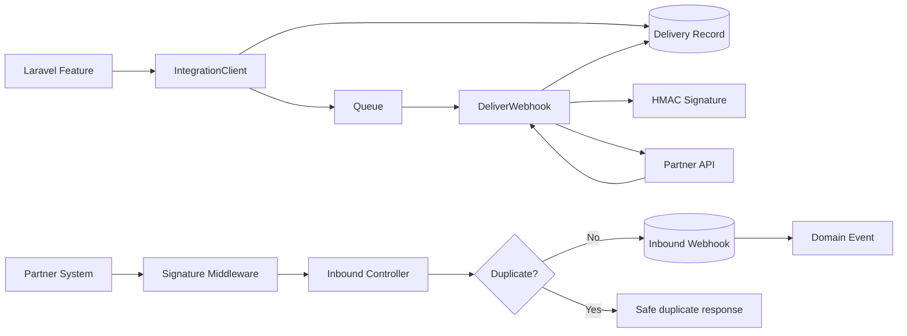
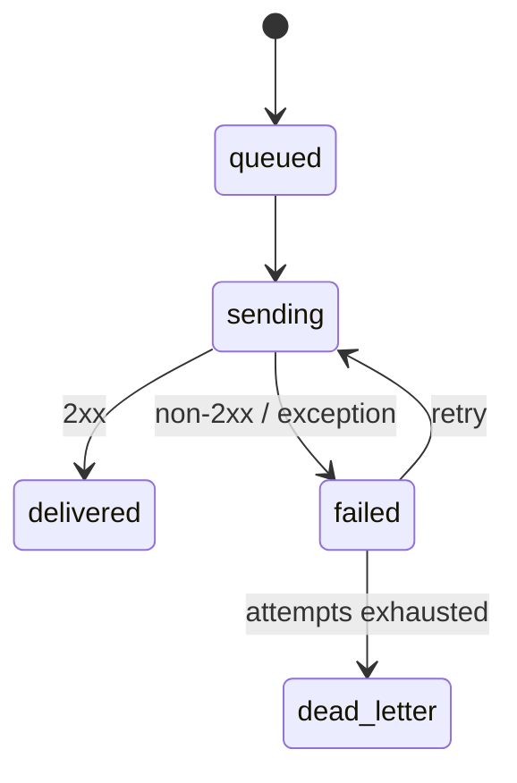

# RelayHub — Laravel API & Webhook Integration Service

**A Laravel reference implementation for reliable third-party integrations: signed webhooks, queues, retries, idempotency, audit logs, and testable service boundaries.**

This repository focuses on the failure-prone part of API integrations: what happens when the remote service is slow, returns an error, retries the same event, or sends a callback you need to authenticate.

## What this project demonstrates

- Laravel service-provider/package architecture
- REST API endpoints
- HMAC-SHA256 webhook authentication
- Queue-based outbound delivery
- Configurable retries and backoff
- Dead-letter state after terminal failure
- Inbound and outbound idempotency
- Eloquent audit models
- Structured integration configuration
- PHPUnit coverage for signature behavior
- GitHub Actions CI across multiple PHP versions

## Architecture



More detail: [`docs/ARCHITECTURE.md`](docs/ARCHITECTURE.md).

## Outbound usage

```php
use Dagemawi\RelayHub\Services\IntegrationClient;

$delivery = app(IntegrationClient::class)->dispatch(
    'invoice.paid',
    [
        'invoice_id' => 7842,
        'amount' => 129.50,
        'currency' => 'USD',
    ],
    'invoice-paid-7842'
);
```

The request is persisted first, then delivered asynchronously by the queue worker.

## Inbound usage

Partner systems call:

```http
POST /api/relayhub/webhooks/inbound
```

with:

```text
X-RelayHub-Event: customer.updated
X-RelayHub-Signature: <HMAC-SHA256>
Idempotency-Key: partner-customer-event-9182
```

Authenticated first-time requests create an inbound record and dispatch `InboundWebhookReceived`. Replays with the same idempotency key return the existing webhook ID instead of processing twice.

## Delivery lifecycle



## Configuration

Publish configuration or use environment variables:

```env
RELAYHUB_INBOUND_SECRET=replace-me
RELAYHUB_OUTBOUND_URL=https://partner.example.com/webhooks
RELAYHUB_OUTBOUND_SECRET=replace-me-too
RELAYHUB_TIMEOUT=10
RELAYHUB_CONNECT_TIMEOUT=3
RELAYHUB_MAX_ATTEMPTS=5
RELAYHUB_QUEUE=integrations
```

See [`.env.example`](.env.example).

## Database observability

Outbound deliveries capture UUID, event name, idempotency key, payload, status, attempts, response code, normalized response body, last exception, and timestamps.

Inbound webhook records provide the same kind of traceability for callbacks received from partners.

## Why idempotency matters

Retries are normal in distributed systems. Without idempotency, a network timeout can turn into a duplicate payment, duplicate order update, duplicate email, or duplicated downstream record.

RelayHub requires a stable inbound idempotency key and also attaches one to outbound requests so both sides can safely retry.

## Testing

```bash
composer install
composer test
```

CI runs PHP linting and PHPUnit on PHP 8.2 and 8.3.

## Security

The repository deliberately keeps credentials out of source control and uses signed payloads, timing-safe comparison, idempotency, bounded HTTP timeouts and queue isolation.

See [`SECURITY.md`](SECURITY.md).

## Engineering focus

This project is intentionally centered on integration reliability rather than CRUD scaffolding. It represents the kind of backend work needed for SaaS platforms, payment integrations, CRM/ERP synchronization, membership systems, marketplace workflows and other API-heavy applications.

## Author

**Dagemawi Alemayehu**  
PHP • Laravel • WordPress • REST APIs • SaaS Engineering
