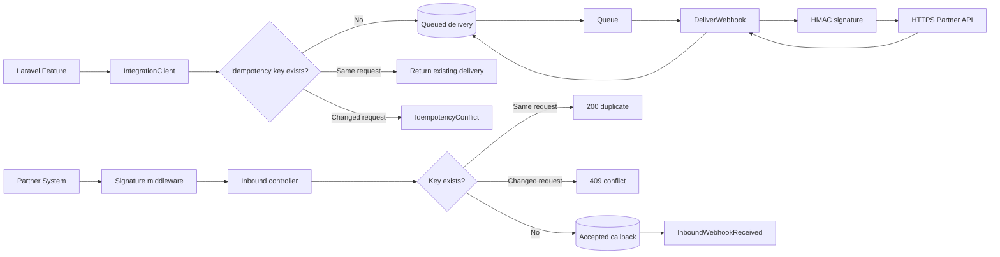
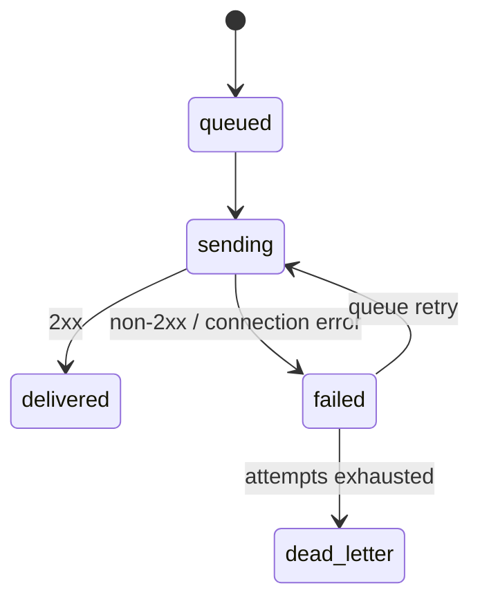

# RelayHub - Laravel API and Webhook Integration

[](https://github.com/DagemawiDeveloper/laravel-api-integration-demo/actions/workflows/tests.yml)

RelayHub is a small Laravel 12 package I use to work through the failure cases that simple API examples usually skip. A caller retries the same request, an idempotency key is reused for different content, a partner returns `503`, or a callback arrives twice. The decisions for those cases are kept in a small codebase so they can be read, tested, and discussed.

## What this project demonstrates

- Laravel package and service-provider architecture
- REST webhook endpoints
- HMAC-SHA256 request authentication
- Queue-based outbound delivery
- Configurable retry and backoff policy
- Explicit `dead_letter` terminal state
- Deterministic inbound and outbound idempotency
- Conflict detection when a key is reused for changed content
- Stable request fingerprints independent of associative-key order
- Eloquent delivery and callback audit models
- HTTPS-only outbound integration boundary
- Response metadata persistence without storing arbitrary partner content
- PHPUnit feature/unit coverage with Orchestra Testbench
- GitHub Actions across PHP 8.2, 8.3, and 8.4

## Architecture



More detail:

- [`docs/ARCHITECTURE.md`](docs/ARCHITECTURE.md)
- [`docs/IDEMPOTENCY.md`](docs/IDEMPOTENCY.md)
- [`SECURITY.md`](SECURITY.md)

## Outbound usage

```php
use Dagemawi\RelayHub\Services\IntegrationClient;

$delivery = app(IntegrationClient::class)->dispatch(
    'invoice.paid',
    [
        'invoice_id' => 7842,
        'amount' => 129.50,
        'currency' => 'USD',
    ],
    'invoice-paid-7842'
);
```

The request is persisted before the queue job is dispatched.

### Replaying the same request

Calling `dispatch()` again with the same key, event, and logically equivalent payload returns the existing delivery and does **not** enqueue a second job. Associative array key order does not affect identity.

### Reusing a key incorrectly

Using the same key for a different event or payload throws:

```php
Dagemawi\RelayHub\Exceptions\IdempotencyConflict
```

This is deliberate. Returning an unrelated existing record would hide a caller bug, while creating a second record would violate the idempotency contract.

Event names must be lowercase tokens using letters, numbers, dots, underscores, or hyphens. Explicit keys must contain between 1 and 190 bytes.

## Inbound usage

Partner systems call:

```http
POST /api/relayhub/webhooks/inbound
Content-Type: application/json
X-RelayHub-Event: customer.updated
X-RelayHub-Signature: <HMAC-SHA256 of the exact raw body>
Idempotency-Key: partner-customer-event-9182
```

Behavior:

| Situation | Response | Side effect |
|---|---:|---|
| First authenticated request | `202` | Persist and dispatch `InboundWebhookReceived` |
| Identical replay | `200` | Return original webhook ID; do not dispatch again |
| Same key, changed event/payload | `409` | Explicit `idempotency_conflict`; no second record |
| Invalid signature | `401` | No persistence or event |
| Missing/invalid request identity | `422` | No persistence or event |
| Malformed or scalar JSON body | `422` | No persistence or event |

## Delivery lifecycle



Outbound requests include:

```text
X-RelayHub-Event
X-RelayHub-Delivery
X-RelayHub-Signature
Idempotency-Key
```

The queue job uses bounded connection/request timeouts and requires a valid HTTPS destination plus a configured signing secret.

## Bounded observability

Delivery records retain operational state—attempt count, status, HTTP status, timestamps, and last error. Remote response bodies are not persisted verbatim. Instead, RelayHub stores:

- byte count;
- SHA-256 digest;
- bounded content type.

This makes failures correlatable without turning an audit table into an uncontrolled copy of partner data or tokens.

## Configuration

```env
RELAYHUB_INBOUND_SECRET=replace-me
RELAYHUB_OUTBOUND_URL=https://partner.example.com/webhooks
RELAYHUB_OUTBOUND_SECRET=replace-me-too
RELAYHUB_TIMEOUT=10
RELAYHUB_CONNECT_TIMEOUT=3
RELAYHUB_MAX_ATTEMPTS=5
RELAYHUB_QUEUE=integrations
```

See [`.env.example`](.env.example).

## Requirements

- PHP 8.2+
- Laravel 12
- A configured queue worker for outbound delivery
- SQLite, MySQL, MariaDB, or PostgreSQL through Laravel's database layer

## Tests

```bash
composer install
composer lint
composer test
```

The suite covers:

- HMAC signing and tamper rejection;
- stable idempotency fingerprints;
- one outbound record/job for a new request;
- identical outbound replay suppression;
- outbound key/content conflicts;
- invalid event/key validation;
- inbound acceptance and one-time event dispatch;
- inbound identical replay and changed-content conflict;
- invalid inbound signatures;
- malformed and scalar inbound JSON;
- successful HTTP delivery and authenticated headers;
- duplicate execution after a completed delivery;
- non-2xx failure state;
- dead-letter transition;
- HTTPS enforcement and retry policy.

CI validates Composer metadata, resolves supported Laravel 12 dependencies, lints PHP, and runs PHPUnit on PHP 8.2, 8.3, and 8.4.

## Limits and trade-offs

RelayHub is a code sample, not an exactly-once delivery system.

- The delivery record and a Redis/SQS queue message cannot be committed atomically. A production system that cannot tolerate that handoff window should use a transactional outbox or a database-backed queue.
- Outbound delivery is still at-least-once if a worker loses its process after the partner accepts the request but before local state is saved. The receiving system must honor `Idempotency-Key`.
- HMAC proves possession of the shared secret, but this sample does not add timestamp freshness or secret rotation.
- SQLite keeps the test suite fast, but real concurrency behavior should also be tested against the production database engine.

Production deployments should also add workload-specific authorization, source restrictions where appropriate, monitoring and alerts, data-retention policy, and reconciliation procedures.

## Author

**Dagemawi Alemayehu**  
PHP • Laravel • WordPress • REST APIs • SaaS Engineering
