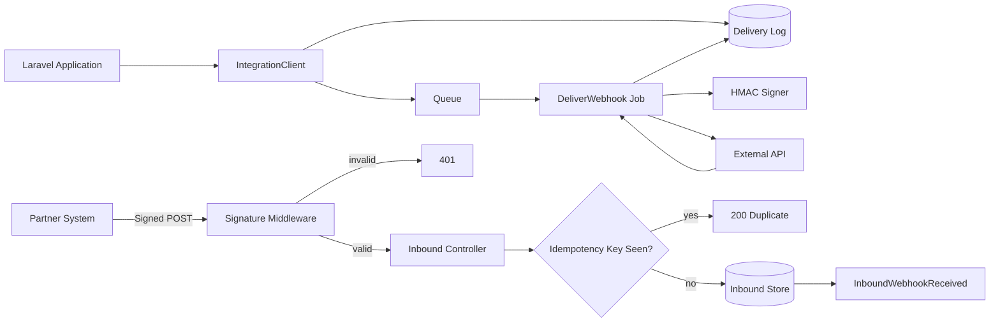

# RelayHub Architecture

## Reliability model

### Queue-first outbound delivery
Application code writes a delivery record and dispatches a queue job instead of waiting for an external API during the user request. This isolates customer-facing latency from integration latency.

### Exponential-style retry schedule
Failed deliveries are retried using configurable backoff values. After the final failed attempt, the record is moved into a `dead_letter` state with the terminal exception captured for investigation.

### Idempotency
Outbound messages have a stable idempotency key. Inbound requests require an `Idempotency-Key` header and duplicates return the original accepted webhook ID instead of executing business logic twice.

### Signed payloads
Raw JSON payloads are authenticated with HMAC-SHA256. Signature checks are timing-safe and happen before inbound payload processing.

### Audit trail
Each delivery tracks status, attempts, response code, response body, last error and delivery timestamps. This creates an operational history for debugging integration failures.
