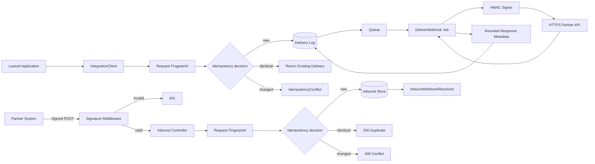

# RelayHub Architecture

## Reliability model

### Persist before dispatch

Application code writes the outbound record before adding the job to the queue. This preserves request identity and gives operations a durable record even when a worker is unavailable.

### Deterministic idempotency

A unique key is not treated as a database implementation detail. It defines request identity:

- same key + same normalized event/payload → return the existing record;
- same key + changed event/payload → explicit conflict;
- new key → create and dispatch exactly once.

Associative payload keys are recursively sorted before hashing, while list order remains meaningful. Details are in [`IDEMPOTENCY.md`](IDEMPOTENCY.md).

`firstOrCreate()` works with the database uniqueness constraint to make duplicate creation safe under competing callers. Side effects are triggered only when the model is newly created.

### Queue retry lifecycle

The job records `sending`, increments attempts, and applies bounded connect/request timeouts. A non-2xx response or connection exception is stored as `failed` and rethrown so the queue can retry. After the configured attempts are exhausted, Laravel calls `failed()` and RelayHub moves the record to `dead_letter`.

### Signed payloads

Raw JSON bodies use HMAC-SHA256, and verification uses `hash_equals()` before the inbound controller processes or persists the request.

### Bounded audit data

Delivery state includes attempts, response code, timestamps, and the last error. Arbitrary remote response content is deliberately not stored. The response audit value contains only size, SHA-256, and bounded content type.

### HTTPS boundary

Outbound delivery requires a syntactically valid `https://` URL and a configured signing secret before the HTTP client is invoked.

## Failure behavior

| Failure | Persisted state | Caller/queue behavior |
|---|---|---|
| Identical duplicate | Existing record | No duplicate side effect |
| Key reused for changed content | Existing record only | Domain exception or HTTP `409` |
| Invalid inbound signature | Nothing | HTTP `401` |
| Partner non-2xx | `failed` | Exception triggers retry |
| Connection exception | `failed` | Original exception triggers retry |
| Attempts exhausted | `dead_letter` | Requires investigation/re-drive |
